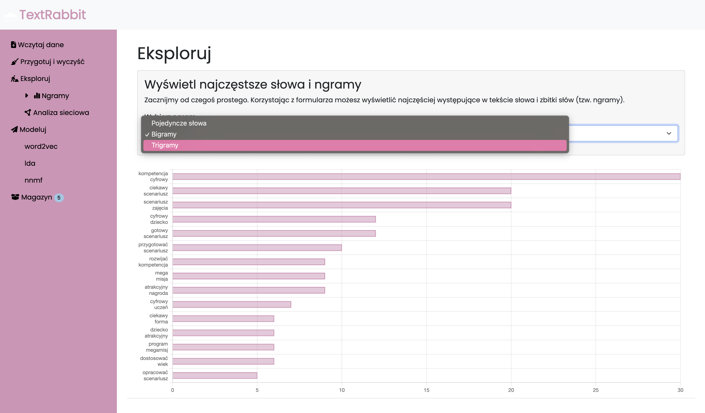
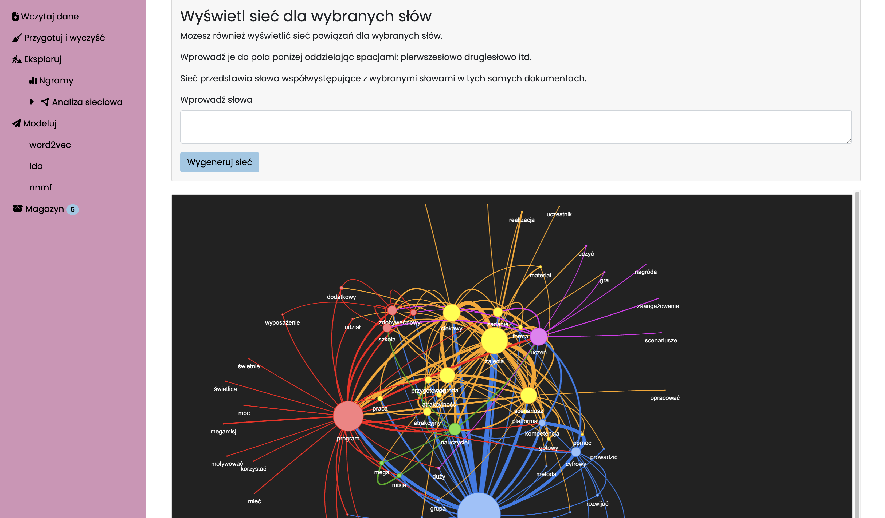

# TextRabbit
Online GUI for unstructured text processing and analysis for the Polish language.

The app implements a number of functionalities from nltk and spacy libraries.

## Intended use

The app is intended to empower researchers with no coding skills to quickly process, visualize and analyze unstructured text.

It was designed to facilitate analysis of unstructured survey data and other similar use-cases, i.e. data consisting of many short, preferably "single-threaded" texts.
    
> **Note:** ⚠️ This project is currently under active development. As such, certain functionalities may not be perfected yet.

## Authorization

The app supports OAuth authorization.

## Data download

The app accepts data in .csv and .xlsx formats. It can also be connected to the [LimeSurvey API](https://manual.limesurvey.org/RemoteControl_2_API).

## Data cleaning and stopwords removal

The app by default performs standard tokenization and lemmatization of your data using nltk library features for the Polish language. It allows for manual corrections of incorrectly lemmatized tokens and adding/removing stopwords.

## Analytical features

### Ngrams

+ Basic ngrams plots (single words, bigrams and trigrams).



### Network analysis

+ Co-occurrence of most common words within _documents_. Can produce meaningful results for relatively short texts.
+ Co-occurrence of words-selected by the user.
+ Network visualization using networkX.
+ Neighborhoods are highlighted using the Louvain algorithm. It allows for the identification of groups of vertices that are more interconnected with each other than with the rest of the network.



### Topic modelling

The app implements following algorithms:
+ Non-negative matrix factorization (NNMF)
+ Latent Dirichlet Allocation (LDA)
+ Latent Semantic Indexing (LSI)

### Word embeddings and clustering

The app uses pre-trained [word embeddings provided by the Polish Academy of Science](http://dsmodels.nlp.ipipan.waw.pl/).

Model specification:
+ Vector length: 300
+ Training corpus: [National Corpus of Polish](http://nkjp.pl/index.php?page=0&lang=1) + Wikipedia
+ Neural net architecture: CBOW
+ Algorithm: Hierarchical softmax

Due to its size, the model is not included in the repository.

Clustering is performed by averaging word-vectors comprising each text and identifying groupings with the k-means algorithm.

## Session states

The application stores data (text being processed, clustering and modeling results) in session on the server and, thus, has limited scalability and is intended for use by small teams. By default, a single user session lasts 12 hours.

The application does not require a data base connection.

## Automatic transcriptions

### Background Task Setup

The application integrates Redis and RQ to manage background tasks:

- **Redis**: Initialized with `Redis.from_url`, connecting to a Redis server using a URL specified in the app's configuration.
- **Task Queue**: An RQ queue named 'szkutnik-tasks' is created, linked to the Redis connection.
- **Background Task**: A task, `update_and_download_transcripts`, is enqueued to run in the background. This task is designed to check for new transcripts in the cloud every hour, download them as needed and update their `transcription_status` in the data base.

### Background Task Execution: Worker Requirement

To enable the execution of background tasks, the Flask application requires a dedicated worker to be started manually. This worker is responsible for monitoring the task queue and executing tasks as they are enqueued.

The worker can be started using the RQ command-line tool, typically with a command like:

```bash
rq worker szkutnik-tasks
```

> When running the worker locally on MacOS it might be necessary to set the `OBJC_DISABLE_INITIALIZE_FORK_SAFETY` to `YES`. This is probably related to a known issue with Python's multiprocessing module on macOS. When a Python script creates a new process (like when a task is enqueued in RQ), the new process is created using the fork system call. However, fork can cause issues with multithreaded programs, which is what the error message is warning about.

This command starts a worker that listens to the 'szkutnik-tasks' queue, which is the queue used by the application for enqueuing background tasks - specifically: `update_and_download_transcripts`.

When deploying the application, it's crucial to ensure that the worker is running in the production environment. The absence of a running worker will result in the background tasks being enqueued but not executed, leading to a backlog of unprocessed tasks.
